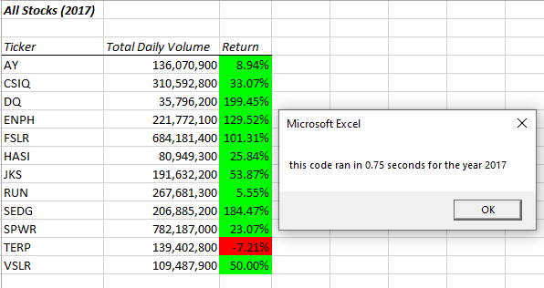
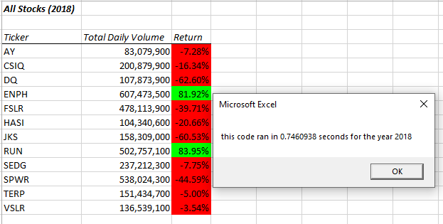
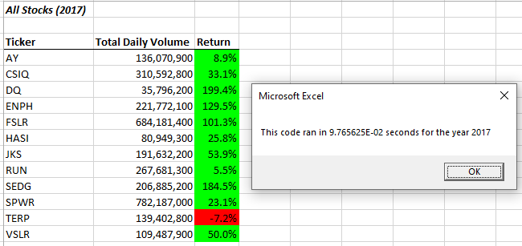
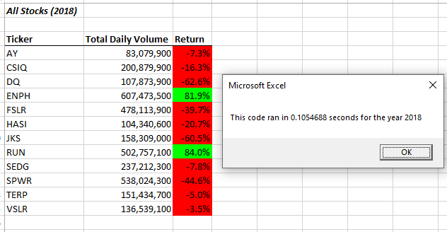

# Stocks-Analysis

## Overview of the Project

### Purpose

The purpose of this project is to refactor VBA code to improve its runtime performance while it analyzes stock performance data for various stocks in a given year and reports the total volume of trades along with annual returns for individual stocks. The client intends to expand the scope of use for the application to include the entire stock market, which will require optimal runtime performance of the application.

## Results and Discussion

### Original Script Performance

The originally developed code structure of the VBA script was effective in executing its task of analyzing stock data with the use of nested For Loops.  The VBA script has demonstrated itself to be able to complete its analysis of data sets containin approximately 3000 rows for each year in less than one second as can be seen by the following graphs:

For the 2017 data the time to run the analysis was 0.75 seconds and the 2018 data was processed in 0.75 seconds.

### Refactored Script Performance

To improve runtime performance, the code was refactored to use a single For Loop and have the output data be stored in a series of arrays that are then used to populate the analysis output worksheet.  The runtime performance of the code showed notable improvement after this refactoring of the VBA script as can be seen below:

For the 2017 data the runtime for analysis dropped to 0.098 seconds and the 2018 data was processed in 0.11 seconds.  This constitutes an approximately 85% reduction in processing time.

The VBA script and data set can be found here: [VBA_Challenge.xlsm](VBA_Challenge.xlsm)

## Summary

Refactoring code is a beneficial and often necessary practice.  Given that operating circumstances for any given application may change or simply that data inputs for data processing systems will often be dynamic in nature, it is important that code be revisited by new developers with new perspectives and experience or even the original developer after time has passed and he or she is able to approach the same code with a fresh perspective.  This can lead to significant improvements in coding performance and expanded scope of an application's functionality.

While the calculated runtimes may be reasonable for data sets of the magnitude of those provided, it may not be acceptable if the script is to be used on much larger data sets.  Should the end user wish to perform analysis on millions of rows of data, the time required to run the application would inhibit productivity.  For this VBA script, optimizing through the use of arrays rather than nested For Loops was essential for taking steps to guarantee productivity for the end user.
